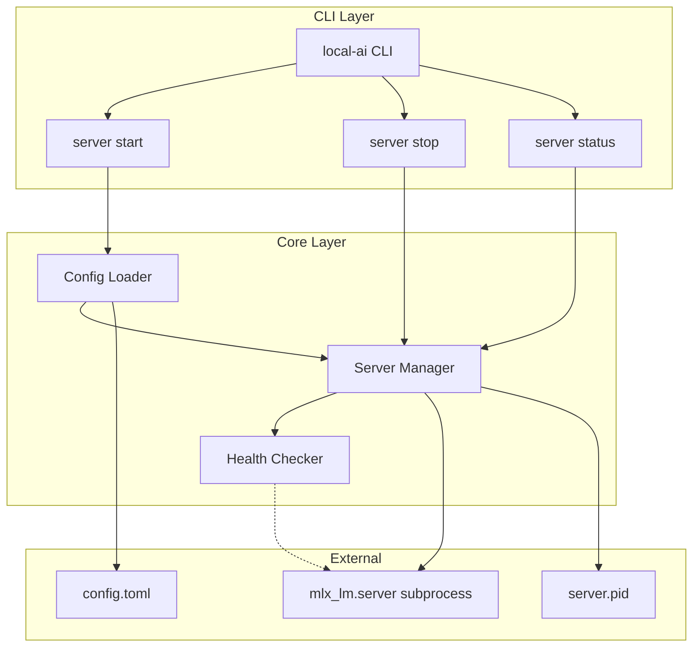
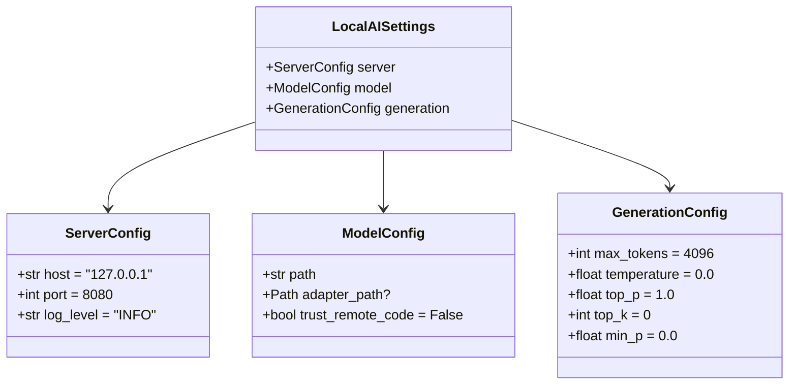
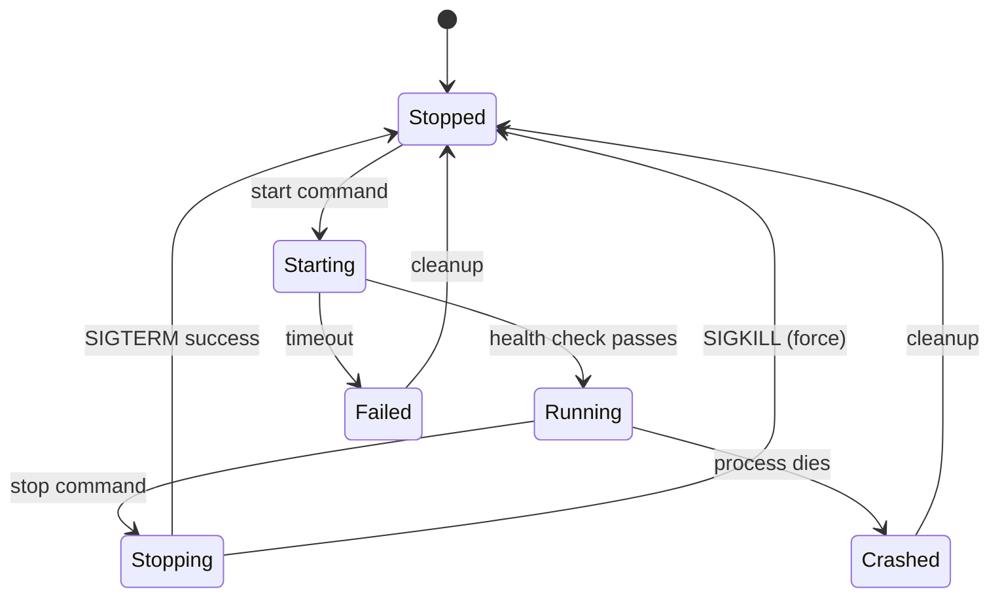

# Design: local-ai

## Overview

local-ai wraps mlx-lm's built-in server to provide systemctl-like process management for serving OpenAI-compatible LLM endpoints on Apple Silicon.



## Component Architecture

### CLI Layer (`src/local_ai/cli/`)

| File | Responsibility |
|------|----------------|
| `main.py` | Typer app root, version callback, subcommand registration |
| `server.py` | Server subcommands: start, stop, restart, status |

### Config Layer (`src/local_ai/config/`)

| File | Responsibility |
|------|----------------|
| `schema.py` | Pydantic v2 settings models for validation |
| `loader.py` | TOML file loading, config resolution, path handling |

### Server Layer (`src/local_ai/server/`)

| File | Responsibility |
|------|----------------|
| `manager.py` | Process lifecycle: spawn, signal, PID file management |
| `health.py` | Health check via `/v1/models` endpoint |

## Configuration Schema



### Resolution Order
1. CLI arguments (highest priority)
2. Environment variables (`LOCAL_AI_SERVER__PORT`)
3. TOML file (`./config.toml` or `~/.config/local-ai/config.toml`)
4. Default values (lowest priority)

## Server Lifecycle



### File Locations (XDG-compliant)

| File | Path | Purpose |
|------|------|---------|
| Config | `~/.config/local-ai/config.toml` | User configuration |
| PID | `~/.local/state/local-ai/server.pid` | Process ID for lifecycle |
| Logs | `~/.local/state/local-ai/server.log` | Server stdout/stderr |

## API Contracts

### ServerManager

```python
class ServerManager:
    def __init__(self, settings: LocalAISettings) -> None: ...
    def start(self, foreground: bool = False) -> StartResult: ...
    def stop(self, force: bool = False, timeout: float = 10.0) -> StopResult: ...
    def status(self) -> ServerStatus: ...
    def is_running(self) -> bool: ...

@dataclass
class StartResult:
    success: bool
    pid: int | None = None
    error: str | None = None

@dataclass
class StopResult:
    success: bool
    error: str | None = None

@dataclass
class ServerStatus:
    running: bool
    pid: int | None
    host: str | None
    port: int | None
    model: str | None
    uptime_seconds: float | None
    health: str | None  # "healthy" | "unhealthy" | "unknown"
```

### Config Loader

```python
def load_config(
    config_path: Path | None = None,
    model: str | None = None,
    port: int | None = None,
    host: str | None = None,
) -> LocalAISettings: ...
```

## Error Handling Strategy

### Error Hierarchy

```python
class LocalAIError(Exception): ...
class ConfigError(LocalAIError): ...
class ServerError(LocalAIError): ...
class HealthCheckError(ServerError): ...
```

### User-Facing Errors

All errors must include:
1. **What** went wrong (clear description)
2. **Why** it happened (root cause if known)
3. **How** to fix it (actionable steps)

Example:
```
Error: Server failed to start on port 8080

Cause: Port is already in use

To fix:
  1. Check what's using the port: lsof -i :8080
  2. Stop the existing process, or
  3. Use a different port: local-ai server start --port 8081
```

## Dependencies

| Package | Version | Purpose |
|---------|---------|---------|
| mlx-lm | >=0.28.4 | MLX model serving |
| typer | >=0.15.0 | CLI framework |
| rich | >=13.0.0 | Console output |
| pydantic | >=2.0.0 | Data validation |
| pydantic-settings | >=2.0.0 | Config loading |
| httpx | >=0.28.0 | HTTP client for health |
| psutil | >=6.0.0 | Process utilities |

## Testing Strategy

### Unit Tests (no GPU required)

| Module | Test Focus |
|--------|------------|
| `config/schema.py` | Validation, defaults, edge cases |
| `config/loader.py` | TOML parsing, file resolution, env override |
| `server/manager.py` | Command building, PID handling (mock subprocess) |
| `server/health.py` | HTTP response handling (mock httpx) |
| `cli/*.py` | Typer parsing, exit codes (mock manager) |

### Integration Tests (may require GPU)

| Test | Focus |
|------|-------|
| Full lifecycle | start → status → stop with real subprocess |
| Health check | Actual HTTP request to running server |

### Mocking Strategy

- **subprocess.Popen**: Mock for unit tests, real for integration
- **httpx.get**: Mock for unit tests, real for integration
- **os.kill**: Mock for unit tests to avoid killing real processes
- **PID file**: Use temp directory for isolation

## Related Documents

- **[VISION.md](./VISION.md)**: Goals and success criteria
- **[PROCESS.md](./PROCESS.md)**: Development workflow and agents
