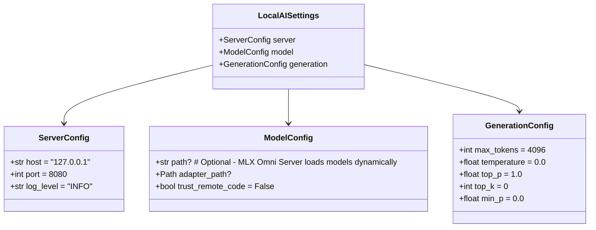

# Design: local-ai

## Overview

local-ai wraps MLX Omni Server to provide systemctl-like process management for serving OpenAI and Anthropic-compatible LLM endpoints on Apple Silicon.

**Why MLX Omni Server over mlx-lm's built-in server:**
- **Dual API support**: Native OpenAI (`/v1/*`) and Anthropic (`/anthropic/v1/*`) endpoints
- **Performance**: FastAPI-based, ~2ms for `/v1/models` (vs ~5000ms with mlx-lm server)
- **KV-cache management**: Intelligent cache trimming for efficient memory use
- **Production readiness**: Async, robust error handling


## Component Architecture

### CLI Layer (`src/local_ai/cli/`)

| File | Responsibility |
|------|----------------|
| `main.py` | Typer app root, version callback, subcommand registration |
| `server.py` | Server subcommands: start, stop, restart, status |

### Config Layer (`src/local_ai/config/`)

| File | Responsibility |
|------|----------------|
| `schema.py` | Pydantic v2 settings models for validation |
| `loader.py` | TOML file loading, config resolution, path handling |

### Server Layer (`src/local_ai/server/`)

| File | Responsibility |
|------|----------------|
| `manager.py` | Process lifecycle: spawn mlx-omni-server, signal, PID file management, welcome page mounting |
| `health.py` | Health check via `/v1/models` endpoint |
| `welcome.py` | Welcome page FastAPI app with model tester interface (NEW) |
| `templates/` | HTML templates for welcome page (NEW) |

## Configuration Schema



### Resolution Order
1. CLI arguments (highest priority)
2. Environment variables (`LOCAL_AI_SERVER__PORT`)
3. TOML file (`./config.toml` or `~/.config/local-ai/config.toml`)
4. Default values (lowest priority)

**Note**: Model configuration is now optional. MLX Omni Server loads models dynamically based on API requests rather than at startup.

## Server Lifecycle


### File Locations (XDG-compliant)

| File | Path | Purpose |
|------|------|---------|
| Config | `~/.config/local-ai/config.toml` | User configuration (model now optional) |
| PID | `~/.local/state/local-ai/server.pid` | Process ID for lifecycle |
| Logs | `~/.local/state/local-ai/logs/` | Server stdout/stderr |

## API Endpoints

MLX Omni Server exposes two API families, plus our custom welcome page:

### Welcome Page (`/`)

| Endpoint | Method | Purpose |
|----------|--------|---------|
| `/` | GET | Welcome page with server status and interactive model tester |

### OpenAI-Compatible (`/v1/*`)

| Endpoint | Method | Purpose |
|----------|--------|---------|
| `/v1/models` | GET | List available models |
| `/v1/chat/completions` | POST | Chat completion (streaming supported) |
| `/v1/completions` | POST | Text completion |

### Anthropic-Compatible (`/anthropic/v1/*`)

| Endpoint | Method | Purpose |
|----------|--------|---------|
| `/anthropic/v1/models` | GET | List models (Anthropic format) |
| `/anthropic/v1/messages` | POST | Messages API (streaming supported) |

## API Contracts

### ServerManager

```python
class ServerManager:
    def __init__(
        self,
        settings: LocalAISettings | None = None,  # Required for start(), optional for stop()/status()
        state_dir: Path | None = None,
        host: str | None = None,  # For status checks, defaults to 127.0.0.1
        port: int | None = None,  # For status checks, defaults to 8080
    ) -> None: ...
    def start(self, foreground: bool = False, startup_timeout: float = 30.0) -> StartResult: ...
    def stop(self, force: bool = False, timeout: float = 10.0) -> StopResult: ...
    def status(self) -> ServerStatus: ...
    def is_running(self) -> bool: ...
    def _create_welcome_app(self) -> FastAPI:  # NEW
        """Create FastAPI app for welcome page and model tester.""" ...

@dataclass
class StartResult:
    success: bool
    pid: int | None = None
    error: str | None = None

@dataclass
class StopResult:
    success: bool
    error: str | None = None

@dataclass
class ServerStatus:
    running: bool
    pid: int | None
    host: str | None
    port: int | None
    models: str | None  # Available models (cached locally, loaded per request)
    uptime_seconds: float | None
    health: str | None  # "healthy" | "unhealthy" | "unknown"
```

### Config Loader

```python
def load_config(
    config_path: Path | None = None,
    model: str | None = None,
    port: int | None = None,
    host: str | None = None,
) -> LocalAISettings: ...
```

## Welcome Page Implementation

The welcome page is implemented by injecting a custom endpoint into the MLX Omni Server's FastAPI application. This requires:

1. **FastAPI Mounting**: Mount our custom routes onto the MLX Omni Server's app
2. **HTML Template**: Simple HTML/CSS/JS for the interactive interface
3. **API Proxy**: Proxy requests to the underlying MLX Omni Server endpoints
4. **Model Testing**: Real-time chat functionality with model selection


### Implementation Approach

```python
# In server/manager.py - enhanced to mount custom routes
class ServerManager:
    def _create_welcome_page_app(self) -> FastAPI:
        """Create FastAPI app with welcome page and model tester."""
        app = FastAPI()
        
        @app.get("/")
        async def welcome_page(request: Request):
            """Serve welcome page with server status and model tester."""
            status = self.status()
            models = get_models(self._host, self._port)
            return templates.TemplateResponse(
                "welcome.html",
                {"request": request, "status": status, "models": models}
            )
        
        @app.post("/api/chat")
        async def proxy_chat(request: Request):
            """Proxy chat requests to MLX Omni Server."""
            data = await request.json()
            async with httpx.AsyncClient() as client:
                response = await client.post(
                    f"http://{self._host}:{self._port}/v1/chat/completions",
                    json=data
                )
            return response.json()
        
        return app
```

### Welcome Page Features

1. **Server Status Display**: Shows current server information (host, port, health, models)
2. **Model Selection**: Dropdown menu with all available models from `/v1/models`
3. **Chat Interface**: Simple text input and response display area
4. **Error Handling**: Clear error messages for model loading failures
5. **Debugging Info**: Technical details for troubleshooting

### Technical Constraints

- **Lightweight**: No heavy frontend frameworks (React, Vue, etc.)
- **Self-contained**: All assets embedded or minimal external dependencies
- **FastAPI Integration**: Must work with MLX Omni Server's existing FastAPI app
- **No Authentication**: Public endpoint for local development use only

## Server Command Construction

The manager spawns `mlx-omni-server` with appropriate arguments:

```python
# Use MLX Omni Server for dual OpenAI/Anthropic API support
# Note: mlx-omni-server loads models dynamically per request
cmd = [
    "mlx-omni-server",
    "--host", self._settings.server.host,
    "--port", str(self._settings.server.port),
]
```

**Note:** Unlike mlx-lm's server, mlx-omni-server doesn't take a `--model` argument. Models are loaded dynamically when requests include the model name in the request body (e.g., `{"model": "mlx-community/Orchestrator-8B-8bit", ...}`).

### Dynamic Model Loading

The server now supports starting without a specific model configuration. This aligns with MLX Omni Server's design where:

1. **No model required at startup** - Server starts immediately
2. **Models loaded on-demand** - First API request triggers model loading
3. **Multiple models supported** - Different requests can use different models
4. **Automatic model discovery** - Available models are listed via `/v1/models` endpoint

This approach provides greater flexibility and matches the underlying MLX Omni Server behavior.

## Error Handling Strategy

### Error Hierarchy

```python
class LocalAIError(Exception): ...
class ConfigError(LocalAIError): ...
class ServerError(LocalAIError): ...
class HealthCheckError(ServerError): ...
```

### User-Facing Errors

All errors must include:
1. **What** went wrong (clear description)
2. **Why** it happened (root cause if known)
3. **How** to fix it (actionable steps)

Example:
```
Error: Server failed to start on port 8080

Cause: Port is already in use

To fix:
  1. Check what's using the port: lsof -i :8080
  2. Stop the existing process, or
  3. Use a different port: local-ai server start --port 8081
```

## Dependencies

| Package | Version | Purpose |
|---------|---------|---------|
| mlx-omni-server | >=0.0.7 | MLX model serving with dual API |
| mlx-lm | <0.28.3 | MLX model utilities (required by mlx-omni-server) |
| typer | >=0.15.0 | CLI framework |
| rich | >=13.0.0 | Console output |
| pydantic | >=2.0.0 | Data validation |
| pydantic-settings | >=2.0.0 | Config loading |
| httpx | >=0.28.0 | HTTP client for health |
| psutil | >=6.0.0 | Process utilities |

### Installation Notes

For Python 3.14 compatibility:
```bash
PYO3_USE_ABI3_FORWARD_COMPATIBILITY=1 uv pip install mlx-omni-server
uv pip install "mlx-lm<0.28.3"  # Required due to API change in 0.28.3+
```

## Testing Strategy

### Unit Tests (no GPU required)

| Module | Test Focus |
|--------|------------|
| `config/schema.py` | Validation, defaults, edge cases |
| `config/loader.py` | TOML parsing, file resolution, env override |
| `server/manager.py` | Command building, PID handling (mock subprocess) |
| `server/health.py` | HTTP response handling (mock httpx) |
| `cli/*.py` | Typer parsing, exit codes (mock manager) |

### Integration Tests (may require GPU)

| Test | Focus |
|------|-------|
| Full lifecycle | start → status → stop with real subprocess |
| Health check | Actual HTTP request to running server |
| Dual API | Both OpenAI and Anthropic endpoints respond |

### Mocking Strategy

- **subprocess.Popen**: Mock for unit tests, real for integration
- **httpx.get**: Mock for unit tests, real for integration
- **os.kill**: Mock for unit tests to avoid killing real processes
- **PID file**: Use temp directory for isolation

## Migration from mlx-lm server

### What Changes

| Aspect | Before (mlx-lm) | After (mlx-omni-server) |
|--------|-----------------|-------------------------|
| Command | `python -m mlx_lm.server` | `python -m mlx_omni_server` |
| Framework | BaseHTTPServer | FastAPI (uvicorn) |
| OpenAI API | `/v1/*` | `/v1/*` (same) |
| Anthropic API | Not available | `/anthropic/v1/*` |
| Performance | ~5000ms for `/v1/models` | ~2ms for `/v1/models` |

### What Stays the Same

- Configuration schema and TOML format
- CLI interface (`local-ai server start|stop|status`)
- PID file management
- Health check mechanism (still queries `/v1/models`)
- Log file locations

## Related Documents

- **[VISION.md](./VISION.md)**: Goals and success criteria
- **[PROCESS.md](./PROCESS.md)**: Development workflow and agents
