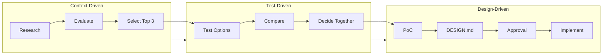
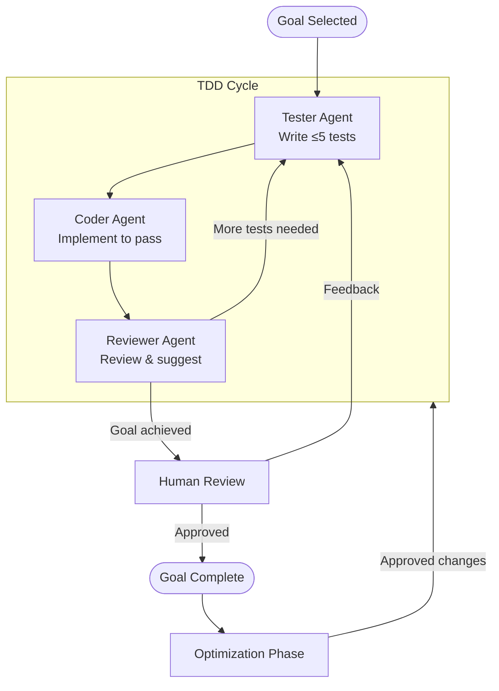

# Process: How We Work

## Overview

Development follows a three-phase approach, progressing from research through validation to implementation. Each phase has defined outputs, decision points, and quality gates.

## Phase 1: Context-Driven Research

**Objective**: Understand the solution space before committing to an approach.

### Activities
1. Research online for libraries, tools, and approaches
2. Evaluate options against project criteria (see VISION.md)
3. Identify top 3 candidates based on:
   - Performance potential (tokens/sec priority)
   - Integration fit (OpenAI-compatible, MLX support)
   - Maintenance health (active development, community)
   - Complexity (simpler is better)

### Output
- Research findings documented
- Top 3 options with rationale
- Recommendation for testing order

### Decision Point
Human reviews options and approves proceeding to testing phase.

## Phase 2: Test-Driven Validation

**Objective**: Validate options with real performance data on target hardware.

### Activities
1. Set up each candidate on local machine
2. Run standardized benchmarks:
   - Tokens per second (primary)
   - Time to first token
   - Memory usage
   - Concurrent request handling
3. Document trade-offs and behaviors

### Output
- Benchmark results table
- Trade-off analysis
- Recommendation with supporting data

### Decision Point
Human and Claude jointly select the approach to pursue based on evidence.

## Phase 3: Design-Driven Implementation

**Objective**: Build a working solution with clear architecture.

### 3a: Proof of Concept
Build minimal working implementation to validate core assumptions.

### 3b: Design Documentation
Create `DESIGN.md` with:
- Architecture diagrams (Mermaid)
- Component responsibilities
- API contracts
- Configuration schema
- Dependency decisions (build vs. use existing library)

### 3c: Approval Gate
Human reviews and approves DESIGN.md before implementation begins.

### 3d: TDD Implementation
See [TDD Workflow](#tdd-workflow) below.

---

## TDD Workflow

Implementation follows strict Test-Driven Development with agent specialization.

### TDD Rules

1. **Tests First**: Write behavioral tests before implementation code
2. **Small Batches**: Maximum 5 tests per tester iteration
3. **Behavior Focus**: Test what the system does, not how
4. **Red-Green-Refactor**:
   - Red: Tests fail (confirming behavior doesn't exist)
   - Green: Minimal code to pass
   - Refactor: Clean up while tests pass
5. **Existing Tests**: Modify existing test suites before creating new ones
6. **Quality Gates**: All tests pass, no warnings, ≥95% coverage

### Iteration Completion Criteria

An iteration completes when:
- All tests pass
- No linter/type warnings
- Coverage ≥95%
- Human confirms goal is achieved

---

## Agent Roles

Agents are defined in `.claude/agents/` with full system prompts. Below is a summary; see individual agent files for complete instructions.

### Coordinator (Main Agent)

**Role**: Orchestrate workflow, maintain context, facilitate communication

**Responsibilities**:
- Track progress toward goals
- Spawn and direct specialized agents
- Synthesize agent outputs
- Manage human communication
- Preserve context across interactions

**Does NOT**:
- Write production code directly
- Write tests directly
- Make unilateral architectural decisions

### Tester Agent

**File**: `.claude/agents/tester.md`
**Model**: inherit (uses main conversation model)

**Role**: Write behavioral contract tests

**Key Behaviors**:
- Maximum 5 tests per invocation
- Public interfaces only
- Behavior focus, not implementation
- Uses pytest with pytest-asyncio

**Invoke**: "Use tester agent to write tests for [interface]"

### Coder Agent

**File**: `.claude/agents/coder.md`
**Model**: inherit

**Role**: Implement minimal code to pass tests

**Key Behaviors**:
- Red-Green-Refactor discipline
- No over-engineering
- No premature optimization
- Runs tests to verify progress

**Invoke**: "Use coder agent to implement [component]"

### Reviewer Agent

**File**: `.claude/agents/reviewer.md`
**Model**: opus (thorough analysis)

**Role**: Quality assurance and test expansion guidance

**Key Behaviors**:
- Reviews both tests and code
- Suggests next test scenarios (max 5)
- Does not write code, only advises
- Prioritizes suggestions by importance

**Invoke**: "Use reviewer agent to review [component]"

### Researcher Agent

**File**: `.claude/agents/researcher.md`
**Model**: opus (comprehensive research)

**Role**: Technical research and evaluation (Phase 1)

**Key Behaviors**:
- Evidence-based recommendations
- Comparison matrices
- Top 3 candidate identification
- Uses web search for current information

**Invoke**: "Use researcher agent to evaluate [topic]"

---

## Autonomy Levels

### Proceed Without Asking

The Coordinator may proceed autonomously when:
- Executing approved plans
- Running tests and benchmarks
- Fixing failing tests within approved design
- Refactoring without changing behavior
- Creating working documents (not VISION/PROCESS/DESIGN)

### Must Ask for Approval

The Coordinator must request human approval when:
- Changing goals or scope
- Selecting between approaches (end of research phase)
- Approving design documents
- Completing a goal (confirmation needed)
- Encountering blockers that require scope changes
- Proposing optimizations or refactorings
- Modifying VISION.md, PROCESS.md, or DESIGN.md

### Escalation Triggers

Immediately notify human when:
- Tests cannot pass within current design
- Performance targets appear unachievable
- Critical dependency has blocking issues
- Scope creep detected

---

## Working Documents

These documents capture transient state and progress:

| Document | Purpose | Updates |
|----------|---------|---------|
| `docs/RESEARCH.md` | Capture research findings | During Phase 1 |
| `docs/BENCHMARKS.md` | Performance test results | During Phase 2 |
| `docs/DECISIONS.md` | ADR-style decision log | When significant choices made |
| `docs/PROGRESS.md` | Current status and blockers | Each session |

---

## Review Cycles

### Goal Completion Review

After each goal is achieved:
1. Human tests the implementation personally
2. Feedback collected and documented
3. TDD cycle continues until human satisfied
4. VISION.md, PROCESS.md reviewed for learnings
5. Next goal selected

### Optimization Phase

After goal completion review:
1. All agents perform thorough code review
2. Identify refactoring and optimization opportunities
3. Present to human with:
   - What: Specific change proposed
   - Why: Rationale and value
   - Impact: Improvement toward goals
4. Human approves/defers optimizations
5. Approved changes implemented via TDD cycle

---

## Quality Standards

### Code Quality Gates

All code must pass before "done":
- [ ] All tests pass
- [ ] No linter warnings
- [ ] No type errors
- [ ] Coverage ≥95%
- [ ] No placeholder code (TODO, FIXME, NotImplementedError)
- [ ] Documentation updated

### Test Quality Criteria

- Tests describe behavior, not implementation
- Tests survive refactoring
- Tests have clear, descriptive names
- Tests cover happy path and error cases
- Tests are independent and isolated

### Documentation Quality

- Architecture diagrams are current
- API contracts are accurate
- Configuration is documented
- Error messages are actionable

---

## Related Documents

- **[VISION.md](./VISION.md)**: Goals G1-G4 and success criteria we're working toward
- **[DESIGN.md](./DESIGN.md)**: Technical architecture (created during Phase 3)
- **[../.claude/agents/](../.claude/agents/)**: Agent definitions with full system prompts
